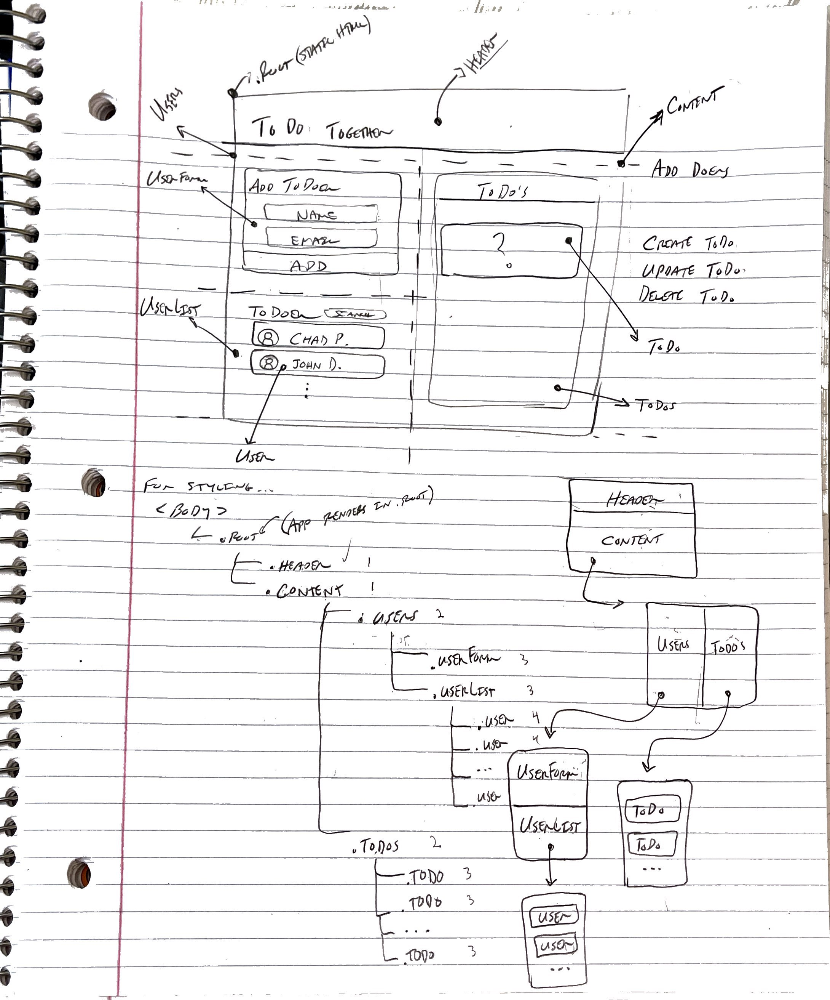
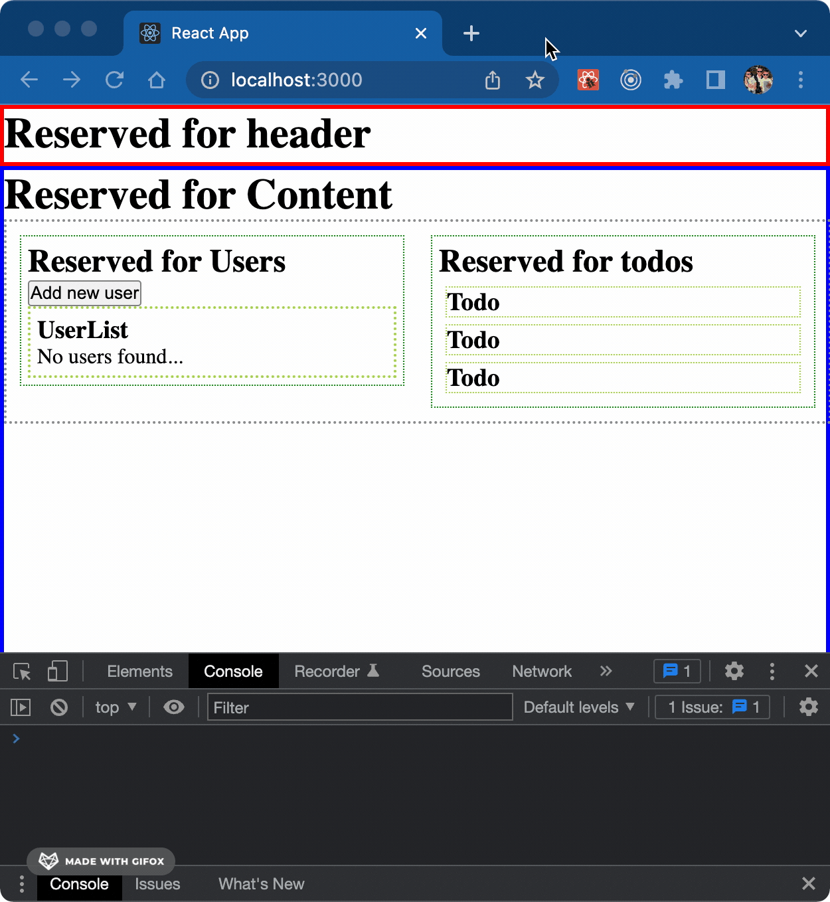

# ToDoer's List

*Because maximum productivity is a team effort!*

# Visualizing the development process

> I love the development lifecycle.  This section documents each step taken as the app grows from conception to minimum viable product and beyond.
  

## *Wire framing on paper*
>The initial sketch to guide the app organization / layout.

    

  

## *Crafting a responsive frontend*
>Here we can see the sloppy wire frame realized in a browser with the help of some boarders around each component.

    

  

## *Introducing state*
>The Users component hides/displays UserForm and manages all users in UserList. Users are dynamically rendered as they are added. UserForm validates input in the following ways:
1. Ensures name field isn't empty.
2. Validates e-mail format using regex.
3. Prevents rendering users with invalid entries.
  

    

